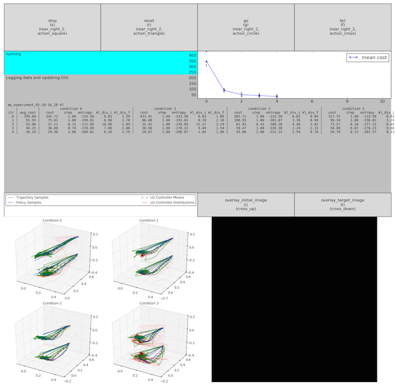

GUI
===
# Command Line usage
```sh
cd /path/to/gps
python python/gps/gps_main.py -h
usage: gps_main.py [-h] [-n] [-t] [-r N] experiment

Run the Guided Policy Search algorithm.

positional arguments:
  experiment         experiment name

optional arguments:
  -h, --help         show this help message and exit
  -n, --new          create new experiment
  -t, --targetsetup  run target setup
  -r N, --resume N   resume training from iter N
```
Intended usage:
1. `python python/gps/gps_main.py <EXPERIMENT_NAME> -n`

Creates a new experiment folder at  `experiments/<EXPERIMENT_NAME>` with an empty hyperparams file `hyperparams.py`. Copy and paste your old `hyperparams.py` from your previous experiment and make any modifications.

2. `python python/gps/gps_main.py <EXPERIMENT_NAME> -t` (for ROS only)

Opens the Target Setup GUI, for target setup when using ROS. See the [Target Setup](#Target Setup GUI) section below.

3. `python python/gps/gps_main.py <EXPERIMENT_NAME>` 

Opens the GPS Training GUI and runs the guided policy search algorithm for your specific experiment hyperparams. See the [GPS Training GUI](#GPS Training GUI) section below.

4. `python python/gps/gps_main.py <EXPERIMENT_NAME> -r N`

Resumes the guided policy search algorithm, loading the algorithm state from iteration N. (The file `experiments/<EXPERIMENT_NAME>/data_files/algorithm_itr_<N>.pkl` must exist.)

5. For your reference, your experiments folder contains the following:

* `data_files/` - holds the data files
* `data_files/algorithm_itr_<N>.pkl` - the algorithm state at iteration N
* `data_files/traj_samples_itr_<N>.pkl` - the trajectory samples collected at iteration N
* `data_files/pol_samples_itr_<N>.pkl` - the policy samples collected at iteration N
* `data_files/figure_itr_<N>.png` - an image of the GPS Training GUI figure at iteration N
* `hyperparams.py` - the hyperparams used for this experiment
* `log.txt` - the log text of output from the Target Setup GUI and the GPS Training GUI
* `targets.npz` - the targets used for this experiment

# Target Setup GUI (for ROS only)
`python python/gps/gps_main.py <EXPERIMENT_NAME> -t`


The Target Setup GUI is composed of four parts: the Action Panel, the Action Status TextBox, the Targets TextBox, and the Image Visualizer.

#### The Action Panel
The Action Panel consists 12 actions which can be performed, either by clicking the button, pressing the keyboard shortcut, or using the PS3 Controller shortcut:
* `prev_target_number` - switch to the previous target number (0-9)
* `next_target_number` - switch to the next target number (0-9)
* `next_actuator_type` - switch to the next actuator type (TRIAL_ARM, AUXILIARY_ARM)
* `set_initial_position` - set the initial position (manually move the robot to the desired position and then press set)
* `set_target_position` - set the target position (manually move the robot to the desired position and then press set)
* `set_initial_image` - set the initial image (associated with the initial position)
* `set_target_image` - set the target image (associated with the target position)
* `move_to_initial` - move to the initial position (queries AgentROS to physically move the robot and lock in place)
* `move_to_target` - move to the target position (queries AgentROS to physically move the robot and lock in place)
* `relax_controller` - relaxes the robot controllers, so they can be moved again (after `move_to_initial` or `move_to_target` locks them in place)
* `mannequin_mode` - toggles mannequin mode on or off (for the robot's arms to stay in place after physically moving them)
#### The Action Status TextBox
The Action Status Textbox indicates whether or not the actions were performed successfully or failed.
#### The Targets TextBox
The Targets TextBox displays the target values for the current target number and actuator type, including:
* `target number` - the current target number
* `actuator type` - the current actuator type
* `initial pose` - the initial poses' `joint angles`, `end effector points`, and `end effector rotations`
* `target pose` - the target poses' `joint angles`, `end effector points`, and `end effector rotations`
* `initial image` - the initial image associated with the initial pose, displayed on the bottom left
* `target image` - the target image associated with the target pose, displayed on the bottom right
#### The Image Visualizer
Displays the real-time images outputted by the PR2's on-board Kinect. Has options to overlay the initial image and the target image.

# GPS Training GUI
`python python/gps/gps_main.py <EXPERIMENT_NAME>`



The GPS Training GUI is composed of seven parts: the Action Panel, the Action Status TextBox, the Algorithm Status TextBox, the Cost Plot, the Algorithm Output TextBox, the 3D Trajectory Visualizer, and the Image Visualizer.
#### The Action Panel
The Action Panel consists 4 actions which can be performed, either by clicking the button, pressing the keyboard shortcut, or using the PS3 Controller shortcut:
* `stop` - stop the robot from collecting samples (after the current sample has completed), used to perform a manual reset of the robot's arms
* `reset` - reset the robot to the initial position (after the current sample has completed), used to perform a manual reset of the objects in the scene
* `go` - start/restart the robot to collect samples (after using `stop`, `reset`, or `fail`), used to resume training after stop, reset or fail
* `fail` - fail the current sample being collected and recollect that sample (after the current sample has completed), used to recollect a sample that was conducted under faulty conditions
#### The Action Status TextBox
The Action Status Textbox indicates whether or not the actions were performed successfully or failed.
#### The Algorithm Status TextBox
The Algorithm Status TextBox indicates what is the current status of the algorithm (sampling, calculating, logging data, etc.).
#### The Cost Plot
The Cost Plot, after each iteration, plots the cost per condition (as points) and the mean cost (as a connected line between iterations).
#### The Algorithm Output Textbox
The Algorithm Output Textbox outputs, after each iteration, outputs the iteration number and the mean cost, and for each condition the cost, the step_multiplier, the Linear Gaussian controller entropy, and the initial and final KL Divergences (for BADMM only).
#### The 3D Trajectory Visualizer
The 3D Trajectory Visualizer, after each iteration, plots the trajectory samples collected (green lines), the policy samples collected (blue lines), the linear gaussian controller means (dark red crosses), and the linear gaussian controller distributions (red ellipses).
#### The Image Visualizer
Displays the real-time images outputted by the PR2's on-board Kinect. Contains the below two actions:
* `overlay_initial_image` - overlays the initial image set by the Target Setup GUI (press `reset` at the end of sampling to reset the robot to the initial position and check if the image matches the initial image set by the Target Setup GUI
* `overlay_target_image` - overlays the target image set by the Target Setup GUI (press `stop` at the end of sampling to stop the robot at the target position and check if the image matches the target image set by the Target Setup GUI

# FAQ
#### General
`/path/to/gps/python/gps/gui/`
##### 1. How do I display my own images in the Image Visualizer?
Image Visualizer either listens for images on a ROS topic (default: /camera/rgb/image_color), or can be manually passed new information via the `update` method.
#### Target Setup GUI
`/path/to/gps/python/gps/gui/target_setup_gui.py`
#### GPS Training GUI
`/path/to/gps/python/gps/gui/gps_training_gui.py`
##### 1. How do I turn off the GPS Training GUI?
At the bottom of the `hyperparams.py` file, in the `config` dictionary set `gui_on` to `False`.
##### 2. How do I not display the Image Visualizer?
This feature will be added soon.
##### 3. Why is the algorithm output text overflowing?
Matplotlib does not handle drawing text very smoothly. Either decrease the amount of iteration data printed (see the `update` function of `gps_training_gui.py`), the size at which is printed (see the `fontsize` parameter in the initialization of the `self._algthm_output` `OutputAxis` in `gps_trainin_gui.py`), or increase your window size.
##### 4. How do I change the algorithm information displayed before the first iteration?
See what algorithm information is printed in the `info` key of the `common` dictionary in `hyperparams.py`.
##### 5. How do I change the iteration data displayed after each iteration?
See how iteration data is printed in the update `update` method of `gps_training_gui.py`.
